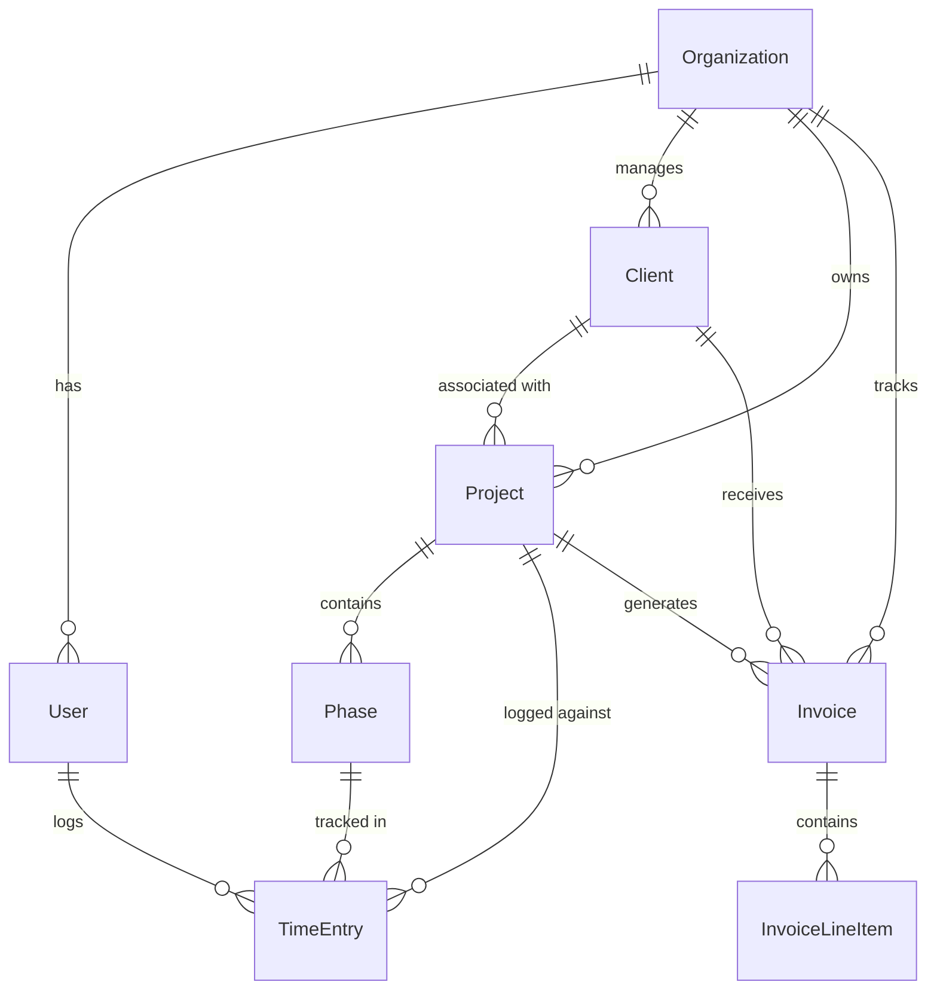

# ArchFlow

> **Design more. Manage less.**
>
> A professional-grade practice management platform for architecture & engineering firms — manage projects, track time, control budgets, invoice clients, and plan resources.

---

## Table of Contents

- [Overview](#overview)
- [Features](#features)
- [Tech Stack](#tech-stack)
- [Project Structure](#project-structure)
- [Database Schema](#database-schema)
- [Getting Started](#getting-started)
- [Architecture & Implementation](#architecture--implementation)
- [Roadmap](#roadmap)

---

## Overview

ArchFlow is a full-stack SaaS application built for small to mid-size architecture and engineering firms (2–100 people). It replaces the fragmented workflow of spreadsheets, QuickBooks, and generic PM tools with a single, purpose-built platform.

### Target Users

- Firm principals & studio owners
- Project managers & project architects
- Design staff logging time
- Bookkeepers managing invoices

### Market Position

Built to compete with **Monograph**, **BQE Core**, and **Deltek Ajera** — but with a modern UI, better pricing, and a developer-friendly architecture.

---

## Features

### Landing Page
A fully designed marketing site with animated hero section, interactive feature showcase, pricing tiers, and a blueprint-canvas background animation.

### Authentication
- **Email/password** signup and login via NextAuth v5 (Auth.js)
- JWT sessions with credential provider
- Each signup creates an **isolated organization** — full multi-tenancy
- Protected dashboard routes with session-based redirects

### Dashboard Overview
- Dynamic greeting with session user's name
- KPI cards: active projects, hours logged, revenue (paid invoices), team utilization
- Active projects table with progress bars and budget indicators
- Team timesheet submission status
- Quick-action links to all modules
- Revenue chart computed from real contract values

### Projects
- Full CRUD via tRPC — create, list, view detail
- Client assignment from DB-populated dropdown
- Phase-based structure with time entry tracking
- Project detail page with:
  - Summary cards (contract value, progress, hours, phases)
  - Interactive phase timeline with expand/collapse
  - Budget-by-phase sidebar with progress bars
  - Loading states and not-found handling

### Time Tracking
- Weekly timesheet grid with 7-day view
- Project picker populated from database
- Phase selection per row
- Built-in timer with start/stop
- Row-level hour entry with daily totals
- Timesheet status workflow: Draft → Submitted → Approved
- Week navigation (previous/next)

### Invoicing
- List view with status badges (Draft, Sent, Paid, Overdue)
- Create invoices with:
  - Client/project selection from DB
  - Dynamic line items (description, qty, rate)
  - Auto-calculated totals
- Status management via tRPC mutations
- Search and status filtering

### Team Management
- Directory view with member cards
- Utilization view with weekly hour bars
- Add team members with role, title, cost/bill rates
- Data derived from time entries (hours, project assignments)

### Budgets
- Phase-level budget tracking per project
- Earned vs. used hours computed from time entries
- Auto-derived status: On Track / At Risk / Over Budget
- Expandable project cards with phase breakdowns
- Safe division guards for empty data

### Reports
- **Revenue**: Monthly bar chart + hours overlay
- **Project P&L**: Revenue vs. cost (hours × avg rate), profit margin
- **Team Utilization**: Billable %, non-billable %, PTO per person
- **Aged Receivables**: Bucketed by days past due (Current, 1-30, 31-60, 61-90, 90+)
- CSV export for all report types

### Settings
- Organization name management
- User profile editing

---

## Tech Stack

| Layer | Technology | Purpose |
|-------|-----------|---------|
| **Framework** | Next.js 16 (App Router) | Full-stack React with SSR |
| **Language** | TypeScript | End-to-end type safety |
| **Styling** | Vanilla CSS + CSS Variables | Custom design system, dark mode ready |
| **Animations** | Framer Motion | Landing page transitions |
| **Icons** | Lucide React | Consistent icon library |
| **API** | tRPC v11 | Type-safe RPC between client and server |
| **Data Fetching** | TanStack React Query v5 | Server state, caching, mutations |
| **Database** | SQLite (via Prisma) | Local dev, swap to PostgreSQL for prod |
| **ORM** | Prisma v5 | Type-safe queries, migrations, seeding |
| **Auth** | NextAuth v5 (Auth.js) | Credentials provider, JWT sessions |
| **Validation** | Zod v4 | Input validation on all tRPC procedures |
| **Hashing** | bcryptjs | Password hashing |

---

## Project Structure

```
archflow/
├── prisma/
│   ├── schema.prisma          # 8 models, SQLite datasource
│   ├── seed.ts                # Demo data seeder
│   └── dev.db                 # SQLite database (gitignored)
│
├── src/
│   ├── app/
│   │   ├── page.tsx           # Landing page (/)
│   │   ├── layout.tsx         # Root layout with fonts
│   │   ├── globals.css        # Design system (CSS variables)
│   │   ├── providers.tsx      # tRPC + React Query + Session providers
│   │   │
│   │   ├── login/page.tsx     # Login form → NextAuth
│   │   ├── signup/page.tsx    # Signup form → /api/auth/signup
│   │   │
│   │   ├── components/        # Landing page components
│   │   │   ├── Hero.tsx       # Animated hero with mock dashboard
│   │   │   ├── Features.tsx   # Feature grid with icons
│   │   │   ├── HowItWorks.tsx # 3-step workflow showcase
│   │   │   ├── Pricing.tsx    # Tier cards
│   │   │   ├── CTA.tsx        # Call-to-action banner
│   │   │   ├── Navbar.tsx     # Top navigation
│   │   │   ├── Footer.tsx     # Site footer
│   │   │   └── BlueprintCanvas.tsx  # Animated background
│   │   │
│   │   ├── dashboard/
│   │   │   ├── layout.tsx     # Sidebar + session guard
│   │   │   ├── page.tsx       # Overview (KPIs, projects, timesheets)
│   │   │   ├── projects/
│   │   │   │   ├── page.tsx   # Project list + create modal
│   │   │   │   └── [id]/page.tsx  # Project detail (phases, budget)
│   │   │   ├── invoices/page.tsx   # Invoice list + create
│   │   │   ├── team/page.tsx       # Member directory + utilization
│   │   │   ├── time/page.tsx       # Weekly timesheet grid
│   │   │   ├── budgets/page.tsx    # Phase-level budget tracking
│   │   │   ├── reports/page.tsx    # Analytics + CSV export
│   │   │   └── settings/page.tsx   # Org & profile settings
│   │   │
│   │   └── api/
│   │       ├── auth/
│   │       │   ├── [...nextauth]/route.ts  # NextAuth handler
│   │       │   └── signup/route.ts         # Registration endpoint
│   │       └── trpc/[trpc]/route.ts        # tRPC HTTP handler
│   │
│   ├── server/
│   │   ├── trpc.ts            # tRPC context, router, procedures
│   │   ├── root.ts            # Root router (merges all routers)
│   │   └── routers/
│   │       ├── project.ts     # list, getById, budgets, clients, create, update, delete
│   │       ├── invoice.ts     # list, create, updateStatus
│   │       ├── team.ts        # list, create, update
│   │       └── time.ts        # logEntry, list, submitWeek
│   │
│   ├── lib/
│   │   ├── db.ts              # Prisma client singleton
│   │   └── auth.ts            # NextAuth config
│   │
│   └── auth.ts                # NextAuth handlers export
│
├── package.json
├── tsconfig.json
└── next.config.ts
```

---

## Database Schema

8 models with full relational integrity:

```
Organization (multi-tenant root)
├── User (team members, auth, rates)
├── Client (firm's clients)
├── Project (name, type, status, contract value, dates)
│   ├── Phase (budget hours, budget amount, fee type)
│   │   └── TimeEntry (date, hours, notes, status)
│   └── Invoice (number, amount, date, status)
│       └── InvoiceLineItem (description, qty, rate)
```

### Key Design Decisions

| Decision | Implementation |
|----------|---------------|
| **Multi-tenancy** | Every entity has `orgId` — all queries scoped to user's org |
| **Phase-based tracking** | Projects contain phases; time entries link to both project and phase |
| **Computed metrics** | Utilization, budget burn, P&L are computed at query time from raw data |
| **Org isolation** | Each signup creates a new Organization — no shared data |



---

## Getting Started

### Prerequisites

- **Node.js** 18+
- **npm** or **pnpm**

### Installation

```bash
# Clone the repository
git clone https://github.com/your-username/archflow.git
cd archflow

# Install dependencies
npm install

# Set up environment variables
cp .env.example .env
# Edit .env and set:
#   DATABASE_URL="file:./dev.db"
#   NEXTAUTH_SECRET="your-secret-key"
#   NEXTAUTH_URL="http://localhost:3000"

# Initialize the database
npx prisma migrate dev --name init
npx prisma db seed

# Start the dev server
npm run dev
```

### Demo Account

After seeding, you can log in with:

| Field | Value |
|-------|-------|
| **Email** | `karan@archflow.io` |
| **Password** | `password123` |

The demo account comes pre-loaded with 5 projects, 3 team members, invoices, time entries, and phases — so you can explore all features immediately.

### Create a Fresh Account

Sign up at `/signup` to create a brand new account with an isolated organization. You'll start with a clean slate — no demo data.

---

## Architecture & Implementation

### API Layer — tRPC

All client-server communication uses **tRPC v11** for end-to-end type safety. No REST endpoints to maintain, no schema drift.

```
Client (React)          Server (Node.js)
    │                        │
    │  trpc.project.list()   │
    ├───────────────────────→│  → Prisma query → SQLite
    │                        │
    │  ← typed response ←   │
    │                        │
```

**4 Routers:**

| Router | Procedures | Purpose |
|--------|-----------|---------|
| `project` | `list`, `getById`, `budgets`, `clients`, `create`, `update`, `delete` | Full project CRUD + budget aggregation |
| `invoice` | `list`, `create`, `updateStatus` | Invoice lifecycle management |
| `team` | `list`, `create`, `update` | Team member management |
| `time` | `logEntry`, `list`, `submitWeek` | Time tracking operations |

All procedures are **protected** — they require an authenticated session and scope data to the user's organization.

### Authentication Flow

```
Signup (/signup)
  → POST /api/auth/signup
  → Create new Organization
  → Create User (role: owner, orgId)
  → Redirect to /login

Login (/login)
  → NextAuth credentials provider
  → Verify email + bcrypt hash
  → Issue JWT session
  → Redirect to /dashboard

Dashboard Access
  → useSession() check
  → No session → redirect to /login
  → Session exists → render dashboard
  → Logout → signOut() → /login
```

### Data Flow Example — Projects Page

```
1. Page mounts → trpc.project.list.useQuery() fires
2. tRPC sends request to /api/trpc/project.list
3. Server middleware extracts session from JWT
4. Router looks up user's orgId
5. Prisma queries: SELECT * FROM Project WHERE orgId = ? JOIN Client
6. Response flows back through tRPC → typed data in React
7. UI renders project cards with real data
8. Create mutation → trpc.project.create.useMutation()
9. On success → utils.project.list.invalidate() → auto-refetch
```

### Design System

Custom CSS-variable-based design system with no CSS framework dependency:

- **Typography**: DM Serif Display (headings) + system sans-serif (body)
- **Color palette**: Warm neutrals with copper accent (`#B07A4A`)
- **Components**: Hand-built cards, modals, tables, dropdowns, progress bars
- **States**: Hover effects, loading spinners, empty state messaging

---

## Roadmap

### ✅ Completed — Phase 1 (Current)

- [x] Landing page with marketing components
- [x] Authentication (signup, login, session management)
- [x] Multi-tenant database schema (8 models)
- [x] tRPC API layer (4 routers, 17 procedures)
- [x] Dashboard overview with live KPIs
- [x] Projects CRUD with detail view
- [x] Time tracking (weekly grid, timer, project picker from DB)
- [x] Invoicing (create, list, status management)
- [x] Team management (directory, utilization)
- [x] Budget tracking (phase-level, computed from time entries)
- [x] Reports (P&L, utilization, aged receivables, CSV export)
- [x] Settings page

### 🔜 Phase 2 — Planned

- [ ] Client portal (view project progress, invoices)
- [ ] Gantt chart for phase timeline visualization
- [ ] Proposal tracking (pipeline → sent → won → lost)
- [ ] Consultant collaboration (free accounts, limited access)
- [ ] Document management (file storage per project)
- [ ] QuickBooks / Xero integration
- [ ] Stripe payment integration on invoices
- [ ] PDF invoice export
- [ ] Email notifications (invoice delivery, timesheet reminders)
- [ ] Advanced resource forecasting

### 🔮 Phase 3 — Future

- [ ] AI-powered budget estimation from historical data
- [ ] Auto-generated weekly status reports
- [ ] Mobile app (React Native)
- [ ] SSO (Google, Microsoft)
- [ ] Real-time collaboration (WebSockets)
- [ ] Custom report builder

---

## Scripts

```bash
npm run dev          # Start development server
npm run build        # Production build
npm run start        # Start production server
npm run lint         # Run ESLint
npx prisma studio    # Open Prisma database GUI
npx prisma db seed   # Re-seed demo data
npx tsc --noEmit     # Type check (zero errors)
```

---

## License

MIT

---

<p align="center">
  <strong>ArchFlow</strong> — Design more. Manage less.
</p>
